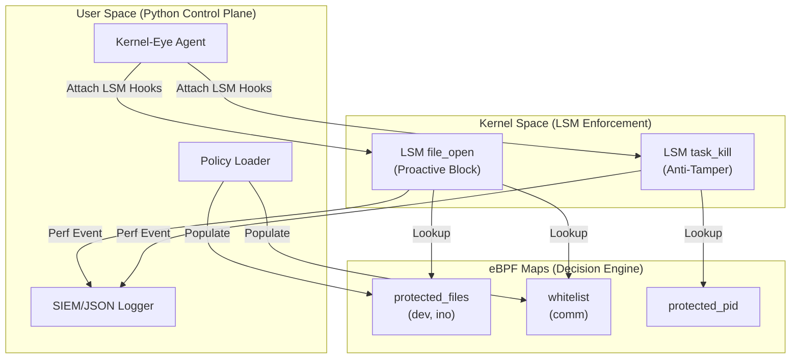

# Kernel-Eye v3.0: Kernel-Level Threat Detection & Blocking


**Kernel-Eye** is a kernel-resident Endpoint Detection and Response (EDR) agent that enforces security policy at the Linux LSM layer. It combines eBPF instrumentation with LSM hooks to provide deterministic, in-kernel blocking of malicious activity while streaming structured telemetry to user space for SIEM ingestion.

## What’s New in v3.0

- **Kernel-Level Enforcement:** Critical policy decisions are enforced inside the kernel using LSM hooks, eliminating TOCTOU windows associated with user-space reaction.
- **Map-Driven Policy Engine:** High-performance O(1) decisions using eBPF maps for protected file identity and process allowlisting.
- **Tamper Resistance:** LSM-based anti-tamper logic prevents termination of the agent itself.

## Architecture

Kernel-Eye v3.0 replaces reactive, user-space SIGKILL enforcement with **proactive LSM-based blocking**. The `file_open` hook executes at the point of authorization and returns `-EPERM` for protected files when the calling process is not allowlisted. The `task_kill` hook provides self-protection by rejecting lethal signals directed at the agent, turning tamper attempts into security events.

Policy decisions are executed in-kernel using eBPF maps:
- `protected_files`: Hash map keyed by `(dev, ino)` to validate access to sensitive files in O(1) time without path walking.
- `whitelist`: Fixed-width command name map (`comm`) to allow trusted processes.

User space remains responsible for policy loading and JSON logging, while enforcement occurs in kernel space.

## Architecture Diagram



## Features

- **Proactive Kernel Blocking:** LSM `file_open` returns `-EPERM` to deny access to protected files in-kernel.
- **Immortal Mode (Anti-Tamper):** LSM `task_kill` blocks termination attempts against the agent.
- **Fileless Detection:** `memfd_create` monitoring for memory-only payloads.
- **SIEM-Ready Logging:** Structured JSON logs at `/var/log/kernel-eye.json`.
- **Low Overhead:** eBPF + BCC for minimal latency and high visibility.

## Installation

### 1. Prerequisites
- Linux Kernel 5.7+ (Required for LSM hooks)
- BCC (BPF Compiler Collection)
- Python 3.8+
- Root privileges

### For Fedora/RHEL
```bash
sudo dnf install bcc-tools python3-bcc
```

### For Ubuntu/Debian
```bash
sudo apt-get install bpfcc-tools python3-bpfcc
```

### 2. Automatic Install (Recommended)
```bash
git clone https://github.com/ufukulaserdem/Kernel-Eye.git
cd Kernel-Eye
sudo make install
```

## Configuration & Monitoring

**Check Service Status**
```bash
sudo systemctl status kernel-eye
```

**View Live Security Logs**
```bash
tail -f /var/log/kernel-eye.json
```

**Log Format Example**
```json
{"timestamp": "2026-02-02T19:30:00", "severity": "CRITICAL", "event_type": "SECURITY_TAMPERING", "action": "BLOCKED", "details": "LSM DENY"}
```

## Detection Logic

| Alert Type | Trigger Condition | Severity | Action |
| :--- | :--- | :--- | :--- |
| **CRITICAL** | Unauthorized access to `/etc/shadow`, `/etc/sudoers`, `/root/.ssh` | Critical | **LSM Block (-EPERM)** |
| **SUSPICIOUS** | Executing from volatile paths (`/tmp`, `/dev/shm`) | High | **SIGKILL (User Space)** |
| **FILELESS** | Interpreters creating memory-only files via `memfd_create` | High | **SIGKILL (User Space)** |
| **ROOT_EXEC** | Unexpected root commands from non-whitelisted processes | Info | **Log / Monitor** |
| **TAMPER** | Attempts to send lethal signals to the agent | Critical | **LSM Block (-EPERM)** |

## Roadmap

### Completed Capabilities
- [x] Real-Time Dashboard (CLI monitoring)
- [x] Context-Aware Whitelisting
- [x] Active IPS for volatile execution paths
- [x] Anti-Tamper (LSM `task_kill`)
- [x] Fileless Defense (`memfd_create`)
- [x] SIEM Integration (JSON logging)
- [x] Deep Kernel Blocking (LSM `file_open`)
- [x] Inode Tracking for Protected Files

### Future Work & Engineering Goals
- [ ] CO-RE Migration (Rust/Aya)
- [ ] Signature Verification (hash + inode validation for binary integrity)
- [ ] Network Visibility (sock_ops / TC for C2 detection)

## Contributing

Pull requests are welcome. For major changes, please open an issue first to discuss proposed changes.

## Author & Contact

**Ufuk Ulaş Erdem** - CS Student & System Security Researcher
- LinkedIn: [Ufuk Ulaş Erdem](https://www.linkedin.com/in/ufukulaserdem)
- Email: mainufukulaserdem@gmail.com
- Status: Actively looking for Summer 2026 Internship opportunities in Cloud Security, SOC, or Linux System Administration

## License

MIT
