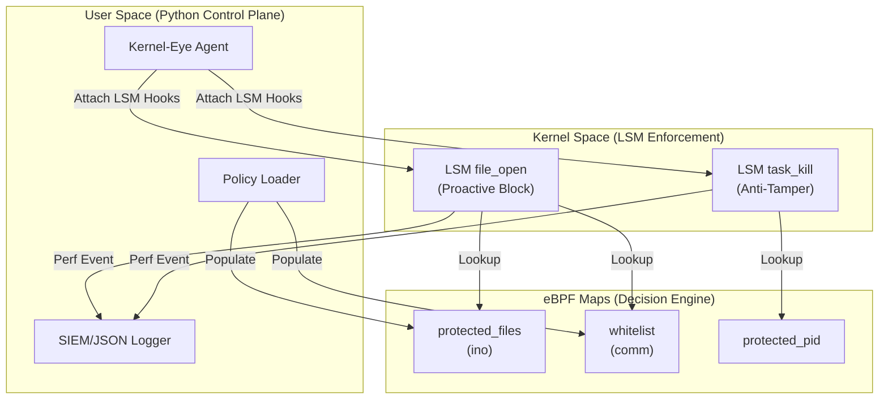

# Kernel-Eye: eBPF/LSM Security Agent


**Kernel-Eye** is a Linux Endpoint Detection and Response (EDR) project that uses eBPF + LSM hooks for kernel-level policy enforcement and telemetry.

## Project Status

**Current State:** Experimental Prototype.
Kernel-Eye is actively in development and is **not production-ready**. We are currently migrating from BCC to CO-RE (`libbpf`) and addressing architectural technical debt.

**Working Capabilities:**

- LSM-based blocking for protected file access (`file_open`).
- LSM anti-tamper behavior for kill attempts against the agent (`task_kill`).
- Telemetry + active response for volatile execution and fileless patterns (`memfd_create`).

Current Limitations (See `ARCHITECTURE_AND_DEBT.md`):\*\*

- **Process Identity:** `comm`-based allowlists are currently used, which are vulnerable to spoofing.
- **File Identity:** Relies on inode-only matching, requiring a transition to stronger identity/integrity semantics.
- **Race Conditions:** Some enforcement relies on user-space `SIGKILL` instead of synchronous kernel-space drops.

For future plans, see the `ROADMAP.md`.

## Core Capabilities

- **Kernel-Level Enforcement:** Protected file access control and anti-tamper checks run in LSM hooks.
- **Map-Driven Policy Engine:** High-performance O(1) decisions using eBPF maps for protected file identity and process allowlisting.
- **Tamper Resistance:** LSM-based anti-tamper logic prevents termination of the agent itself.

## Current Architecture

Kernel-Eye currently uses a **hybrid enforcement** model:

- **Kernel-Space (Synchronous):** In-kernel LSM blocking (`-EPERM`) for protected file access and anti-tamper.
- **User-Space (Asynchronous):** User-space response (`SIGKILL`) for suspicious behaviors like volatile execution.

Policy decisions are executed in-kernel using eBPF maps:

- `protected_files`: Hash map keyed by `ino` (inode).
- `whitelist`: Fixed-width command name map (`comm`).

## Architecture Diagram


```mermaid
flowchart TB
  subgraph UserSpace["User Space (Python Control Plane)"]
    U1[Kernel-Eye Agent]
    U2[Policy Loader]
    U3[SIEM/JSON Logger]
  end

  subgraph Maps["eBPF Maps (Decision Engine)"]
    M1["protected_files\n(ino)"]
    M2["whitelist\n(comm)"]
    M3[protected_pid]
  end

  subgraph Kernel["Kernel Space (LSM Enforcement)"]
    K1["LSM file_open\n(Proactive Block)"]
    K2["LSM task_kill\n(Anti-Tamper)"]
  end

  U2 -->|Populate| M1
  U2 -->|Populate| M2
  K1 -->|Lookup| M1
  K1 -->|Lookup| M2
  K2 -->|Lookup| M3

  K1 -->|Perf Event| U3
  K2 -->|Perf Event| U3
  U1 -->|Attach LSM Hooks| K1
  U1 -->|Attach LSM Hooks| K2
```

## Detection Logic

| Alert Type     | Trigger Condition                                                  | Severity | Action                   |
| :------------- | :----------------------------------------------------------------- | :------- | :----------------------- |
| **CRITICAL**   | Unauthorized access to `/etc/shadow`, `/etc/sudoers`, `/root/.ssh` | Critical | **LSM Block (-EPERM)**   |
| **SUSPICIOUS** | Executing from volatile paths (`/tmp`, `/dev/shm`)                 | High     | **SIGKILL (User Space)** |
| **FILELESS**   | Interpreters creating memory-only files via `memfd_create`         | High     | **SIGKILL (User Space)** |
| **ROOT_EXEC**  | Unexpected root commands from non-whitelisted processes            | Info     | **Log / Monitor**        |
| **TAMPER**     | Attempts to send lethal signals to the agent                       | Critical | **LSM Block (-EPERM)**   |

### 1. Prerequisites

- Linux Kernel 5.7+ (Required for LSM hooks)
- BCC (BPF Compiler Collection)
- Python 3.8+
- Root privileges

### For Fedora/RHEL

```bash
sudo dnf install bcc-tools python3-bcc
```

### For Ubuntu/Debian

```bash
sudo apt-get install bpfcc-tools python3-bpfcc
```

### 2. Automatic Install

```bash
git clone https://github.com/ufukulaserdem/Kernel-Eye.git
cd Kernel-Eye
sudo make install
```

## Configuration & Monitoring

**Check Service Status**

```bash
sudo systemctl status kernel-eye
```

**View Live Security Logs**

```bash
tail -f /var/log/kernel-eye.json
```

**Log Format Example**

```json
{
  "timestamp": "2026-02-02T19:30:00",
  "severity": "CRITICAL",
  "event_type": "SECURITY_TAMPERING",
  "action": "BLOCKED",
  "details": "LSM DENY"
}
```

## Contributing

Pull requests are welcome. For major changes, please open an issue first to discuss proposed changes.

## Author & Contact

**Ufuk Ulaş Erdem** - CS Student & System Security Researcher

- LinkedIn: [Ufuk Ulaş Erdem](https://www.linkedin.com/in/ufukulaserdem)
- Email: <mainufukulaserdem@gmail.com>
- Status: Actively looking for Summer 2026 Internship opportunities in Cloud Security, SOC, or Linux System Administration

## License

MIT
