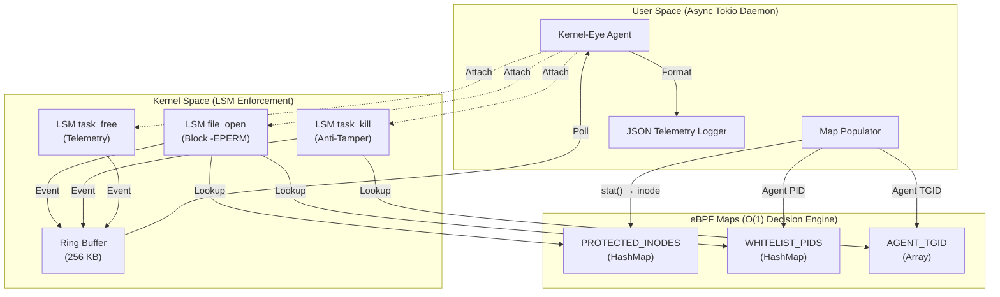

# Kernel-Eye: eBPF/LSM Security Agent


**Kernel-Eye** is a Linux Endpoint Detection and Response (EDR) agent built with `no_std` Rust, eBPF, and LSM hooks. It provides kernel-level policy enforcement, anti-tamper self-protection, and high-throughput SIEM-ready telemetry — all without kernel modules.

## Core Capabilities

| Hook | Function | Mechanism | Status |
| :--- | :--- | :--- | :--- |
| `file_open` | Block unauthorized access to sensitive files (`/etc/shadow`, `/etc/sudoers`, `/root/.ssh/*`) | LSM deny (`-EPERM`) with inode-based lookup | ✅ Implemented |
| `task_kill` | Prevent external processes from killing the agent | LSM deny (`-EPERM`) via TGID comparison | ✅ Implemented |
| `task_free` | Process exit telemetry & whitelist garbage collection | Ring Buffer event stream | ✅ Implemented (Disabled by default to reduce log noise) |

## Architecture

Kernel-Eye uses a **split-architecture** model with three Rust crates:

- **`kernel-eye-ebpf`** — `#![no_std]` eBPF programs compiled to BPF bytecode. Contains the LSM hook implementations and all kernel-side decision logic.
- **`kernel-eye`** — Async Rust daemon (Tokio) that loads the eBPF programs, populates policy maps, and streams telemetry from the Ring Buffer as structured JSON.
- **`kernel-eye-common`** — `#[repr(C)]` aligned data structures shared between kernel and user space.


```mermaid
flowchart TB
  subgraph UserSpace["User Space (Async Tokio Daemon)"]
    U1[Kernel-Eye Agent]
    U2[Map Populator]
    U3[JSON Telemetry Logger]
  end

  subgraph Maps["eBPF Maps (O(1) Decision Engine)"]
    M1["PROTECTED_INODES\n(HashMap<u64, u8>)"]
    M2["WHITELIST_PIDS\n(HashMap<u32, u8>)"]
    M3["AGENT_TGID\n(Array<u32>)"]
  end

  subgraph Kernel["Kernel Space (LSM Enforcement)"]
    K1["LSM file_open\n(Block -EPERM)"]
    K2["LSM task_kill\n(Anti-Tamper)"]
    K3["LSM task_free\n(Telemetry)"]
    R1["Ring Buffer\n(256 KB)"]
  end

  U2 -->|"stat() → inode"| M1
  U2 -->|"Agent PID"| M2
  U2 -->|"Agent TGID"| M3

  K1 -->|Lookup| M1
  K1 -->|Lookup| M2
  K2 -->|Lookup| M3

  K1 -->|Event| R1
  K2 -->|Event| R1
  K3 -->|Event| R1
  R1 -->|Poll| U1
  U1 -->|Format| U3

  U1 -.->|Attach| K1
  U1 -.->|Attach| K2
  U1 -.->|Attach| K3
```

## Detection Logic

| Alert Type | Trigger Condition | Severity | Action |
| :--- | :--- | :--- | :--- |
| **FILE_ACCESS** | Unauthorized `open()` on protected files (`/etc/shadow`, etc.) | CRITICAL | **LSM Block (-EPERM)** |
| **SECURITY_TAMPERING** | External process sends kill signal to agent PID | CRITICAL | **LSM Block (-EPERM)** |
| **PROCESS_EXIT** | Any process exits (task_free) | INFO | **Ring Buffer Telemetry** *(Disabled by default)* |

## Prerequisites

- **Linux Kernel 5.8+** (required for Ring Buffers and LSM BPF)
- **BTF enabled** (`CONFIG_DEBUG_INFO_BTF=y`) — check: `ls /sys/kernel/btf/vmlinux`
- **LSM BPF enabled** — check: `cat /sys/kernel/security/lsm` should include `bpf`
- **Rust Nightly Toolchain** + `bpf-linker`

```bash
rustup toolchain install nightly --component rust-src
cargo install bpf-linker
```

## Build & Run

**1. Generate kernel struct bindings (first time / after kernel update):**
```bash
cargo xtask
```

**2. Build the project:**
```bash
cargo build
```

**3. Run the agent (root required for eBPF):**
```bash
RUST_LOG=info sudo -E ./target/debug/kernel-eye
```

## Log Output (SIEM-Ready JSON)

```json
{"severity":"CRITICAL","event_type":"FILE_ACCESS","action":"BLOCKED","pid":4512,"tgid":4512,"uid":1000,"ino":1835022,"comm":"cat","label":"file_open:BLOCKED"}
{"severity":"CRITICAL","event_type":"SECURITY_TAMPERING","action":"BLOCKED","pid":5001,"tgid":5001,"uid":1000,"ino":0,"comm":"kill","label":"task_kill:BLOCKED"}
{"severity":"INFO","event_type":"PROCESS_EXIT","action":"MONITOR","pid":4512,"tgid":4512,"uid":1000,"ino":0,"comm":"cat","label":"task_free"}
```

## Project Structure

```
Kernel-Eye/
├── kernel-eye/              # User-space async daemon
│   ├── src/main.rs          # Tokio event loop, map population, JSON logging
│   └── build.rs             # eBPF compilation via aya-build
├── kernel-eye-ebpf/         # Kernel-space eBPF programs (no_std)
│   ├── src/main.rs          # LSM hooks: file_open, task_kill, task_free
│   └── src/bindings.rs      # Auto-generated kernel struct bindings
├── kernel-eye-common/       # Shared #[repr(C)] types
│   └── src/lib.rs           # EventData, constants
└── xtask/                   # Build tooling (BTF binding generation)
    └── src/main.rs
```

## Roadmap

- [ ] `memfd_create` tracepoint for fileless malware detection
- [ ] TOML-based configuration for protected paths and whitelist
- [ ] `serde_json` for proper JSON serialization
- [ ] Network socket monitoring via `socket_connect` LSM hook
- [ ] Integration tests with automated eBPF loading
- [ ] CI pipeline with kernel-enabled runner

## Author & Contact

**Ufuk Ulaş Erdem** - 3rd-year CS Student & System Security Researcher

- LinkedIn: [Ufuk Ulaş Erdem](https://www.linkedin.com/in/ufukulaserdem)
- Email: mainufukulaserdem@gmail.com

## License

This project is multi-licensed to comply with eBPF ecosystem standards:
* **User-Space Control Plane:** Dual-licensed under [MIT](LICENSE-MIT) or [Apache-2.0](LICENSE-APACHE).
* **eBPF Kernel Programs:** Licensed under [GPL-2.0](LICENSE-GPL2) to comply with Linux kernel helper restrictions.
