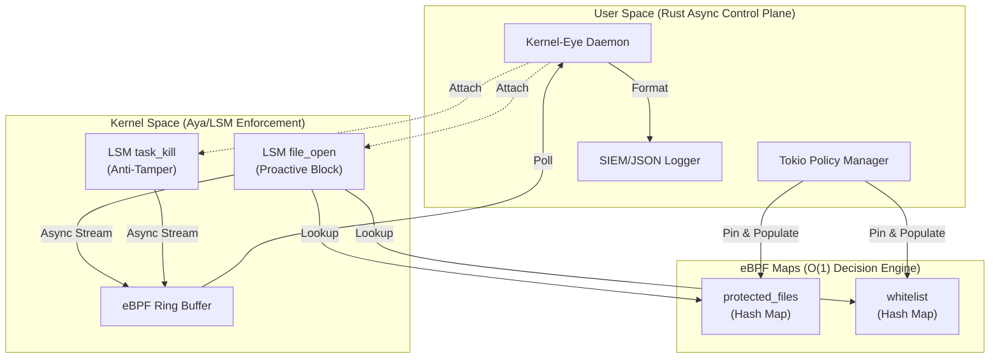

# Kernel-Eye: eBPF/LSM Security Agent


**Kernel-Eye** is a Linux Endpoint Detection and Response (EDR) project that uses `no_std` Rust, eBPF, and LSM hooks for kernel-level policy enforcement and high-throughput telemetry.

## Project Status

**Current State:** Active Migration to Rust/Aya.
Kernel-Eye has moved away from legacy BCC/Python to a **Rust-based CO-RE (Compile Once, Run Everywhere)** architecture. This eliminates the need for LLVM/Clang on target hosts and guarantees memory safety in the user-space control plane.

**Target Capabilities:**
- Deterministic LSM-based blocking for protected file access (file_open).
- Synchronous anti-tamper behavior for kill attempts against the agent (task_kill).
- Async Ring Buffer telemetry for volatile execution and fileless patterns (memfd_create).

## Core Architecture

Kernel-Eye relies on a split-architecture model:
- **Kernel-Space (kernel-eye-ebpf):** Sync LSM blocking (-EPERM) via `no_std` Rust.
- **User-Space (kernel-eye):** Async Rust daemon (Tokio) handling map updates, Ring Buffer telemetry, and SIEM-ready JSON logging.
- **Shared Data (kernel-eye-common):** `#[repr(C)]` aligned structs bridging the kernel and control plane.

## Architecture Diagram

```mermaid
flowchart TB
  subgraph UserSpace["User Space (Rust Async Control Plane)"]
    U1[Kernel-Eye Daemon]
    U2[Tokio Policy Manager]
    U3[SIEM/JSON Logger]
  end

  subgraph Maps["eBPF Maps (O(1) Decision Engine)"]
    M1["protected_files\n(Hash Map)"]
    M2["whitelist\n(Hash Map)"]
  end

  subgraph Kernel["Kernel Space (Aya/LSM Enforcement)"]
    K1["LSM file_open\n(Proactive Block)"]
    K2["LSM task_kill\n(Anti-Tamper)"]
    R1["eBPF Ring Buffer"]
  end

  U2 -->|Pin & Populate| M1
  U2 -->|Pin & Populate| M2
  K1 -->|Lookup| M1
  K1 -->|Lookup| M2

  K1 -->|Async Stream| R1
  K2 -->|Async Stream| R1
  R1 -->|Poll| U1
  U1 -->|Format| U3
  
  U1 -.->|Attach| K1
  U1 -.->|Attach| K2
```
## Detection Logic

| Alert Type     | Trigger Condition                                                  | Severity | Action                   |
| :------------- | :----------------------------------------------------------------- | :------- | :----------------------- |
| **CRITICAL** | Unauthorized access to /etc/shadow, /etc/sudoers, /root/.ssh | Critical | **LSM Block (-EPERM)** |
| **SUSPICIOUS** | Executing from volatile paths (/tmp, /dev/shm)                 | High     | **Ring Buffer Alert** |
| **FILELESS** | Interpreters creating memory-only files via memfd_create         | High     | **Ring Buffer Alert** |
| **TAMPER** | Attempts to send lethal signals to the agent                       | Critical | **LSM Block (-EPERM)** |

## Prerequisites

- Linux Kernel 5.8+ (Required for Ring Buffers and LSM BPF)
- Rust Nightly Toolchain
- bpf-linker
```bash
rustup toolchain install nightly --component rust-src
cargo install bpf-linker
```
## Build & Run
```bash
**1. Compile the eBPF object:**
cargo xtask build-ebpf
```
**2. Run the User-Space Agent (Root required):**
```bash
RUST_LOG=info sudo -E cargo run -- --ebpf-bpf kernel-eye-ebpf
```
## Log Format Example (Target)
```json
{
  "timestamp": "2026-03-25T12:43:35Z",
  "severity": "CRITICAL",
  "event_type": "SECURITY_TAMPERING",
  "action": "BLOCKED",
  "details": "LSM DENY on task_kill",
  "pid": 4512,
  "comm": "malware_bin"
}
```
## Author & Contact

**Ufuk Ulaş Erdem** - 3rd-year CS Student & System Security Researcher

- LinkedIn: [Ufuk Ulaş Erdem](https://www.linkedin.com/in/ufukulaserdem)
- Email: mainufukulaserdem@gmail.com
- Status: Actively looking for Summer 2026 Internship opportunities in Cloud Security, SOC, or Linux System Administration.

## License

This project is multi-licensed to comply with eBPF ecosystem standards:
* **User-Space Control Plane:** Dual-licensed under [MIT](LICENSE-MIT) or [Apache-2.0](LICENSE-APACHE).
* **eBPF Kernel Programs:** Licensed under [GPL-2.0](LICENSE-GPL2) to comply with Linux kernel helper restrictions.
